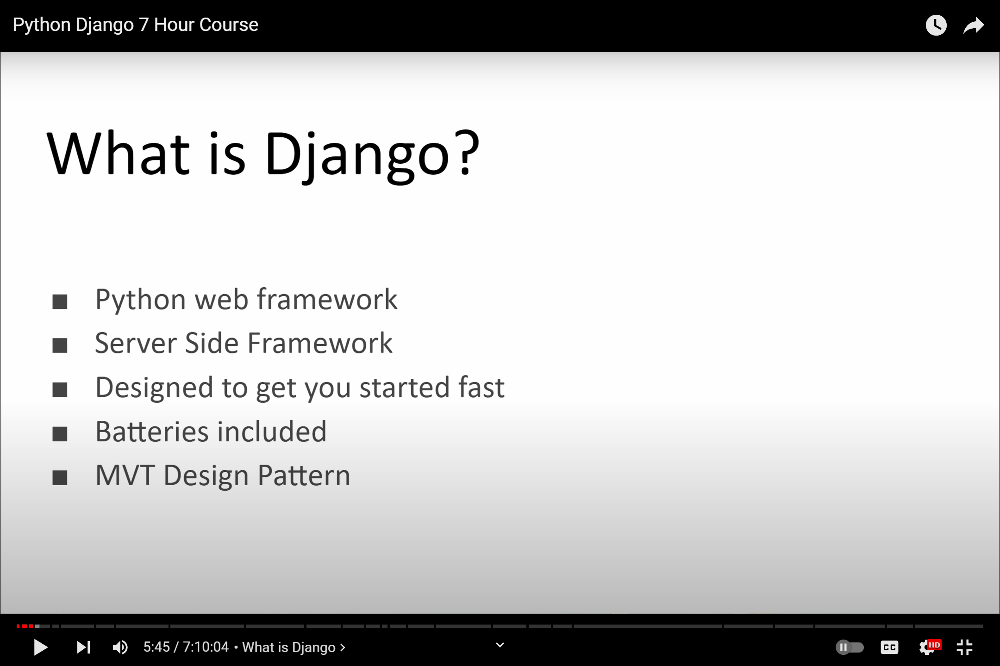
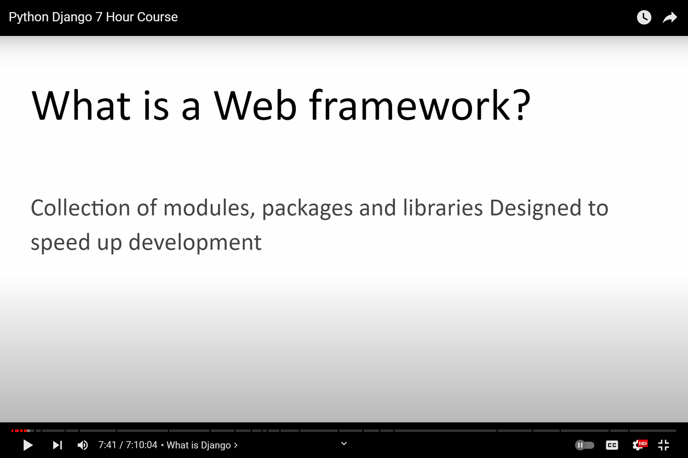
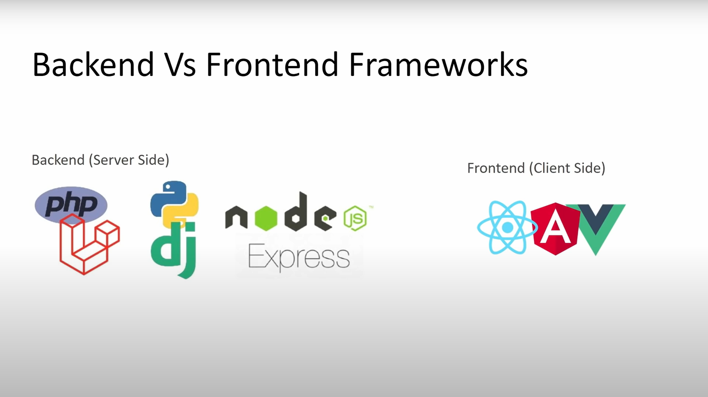
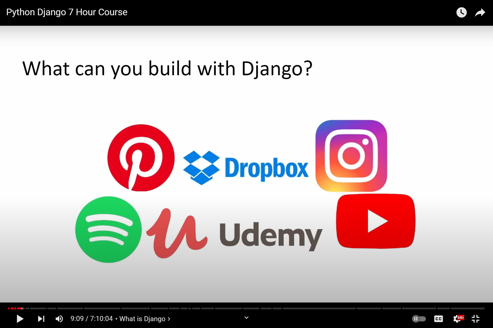
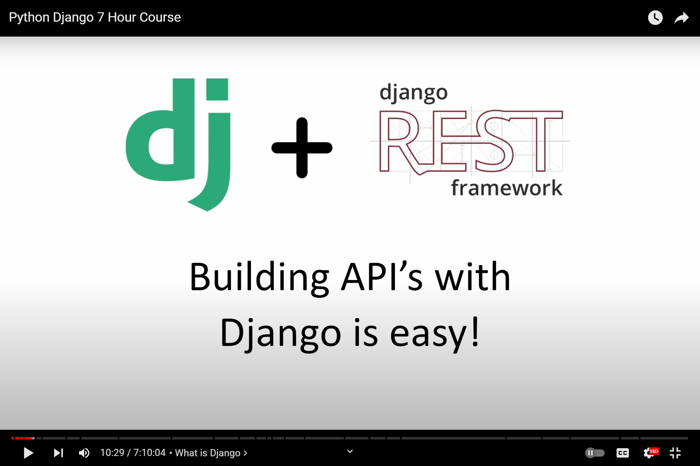
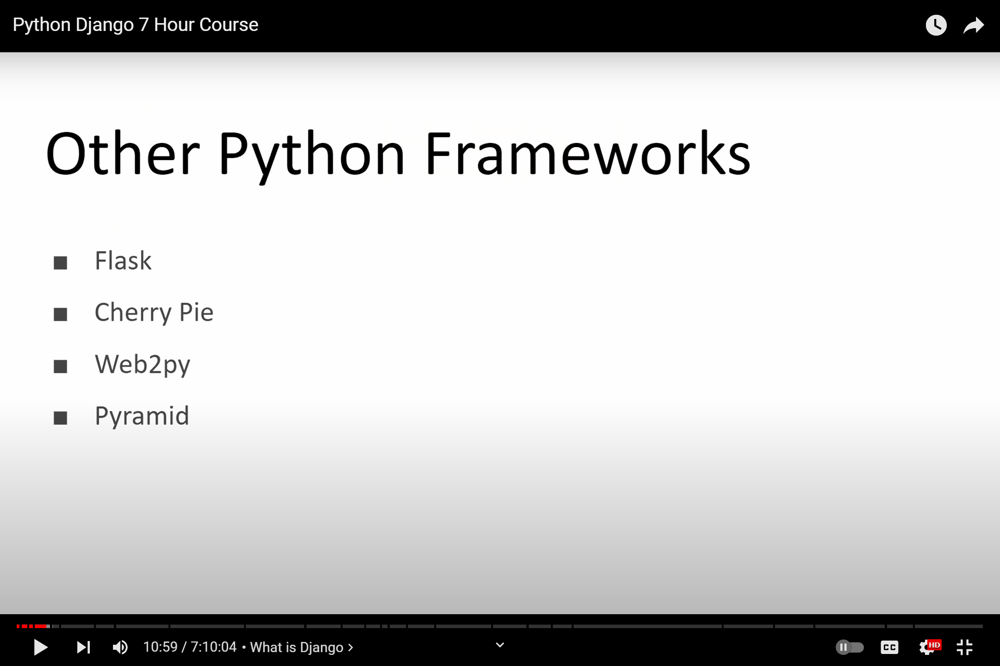
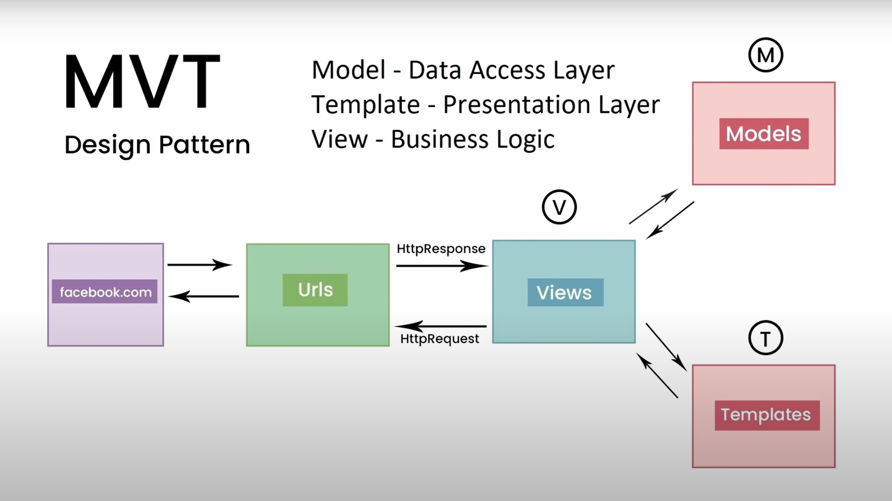
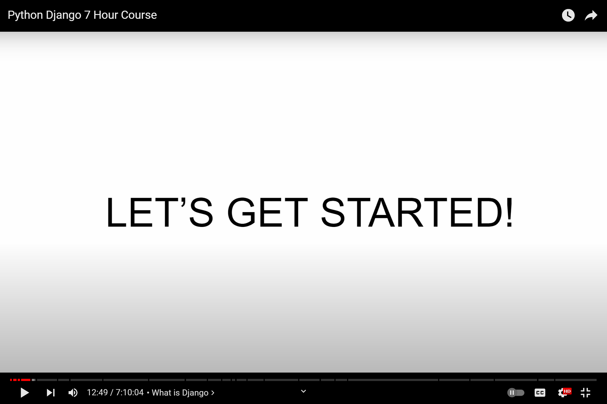

# 7 Hours Django Course by DennisIvy










- Resources - Github Dennis Ivy [StudyBud](https://github.com/divanov11/StudyBud)
- Extensions - Atom One Dark Theme, Prettier, Auto Rename Tag

**Install Virtual Environment:**
```shell
pip install virtualenv
```

**Create Virtual Env:**
```shell
virtualenv env
```

**Activate Env:**
```shell
env\Scripts\activate
```
- To do deactivate Env:
```shell
env\Scripts\deactivate
```

**Install Django:**
```shell
pip install django
```

**Create Project:**
```shell
django-admin startproject studybud .
```
- Most Useful Commands:
  - makemigrations
  - migrate
  - runserver
  - startapp
  - startproject

**Run Server:**
```shell
python manage.py runserver
```

**Create App:**
```shell
python manage.py startapp base
```

**Before creating model run migrate:**
```shell
python mana.py migrate
```


**Create Model then Make Migration:**
```shell
python manage.py makemigrations
# then
python manage.py migrate
```

**Create Admin Dashboard Account:**
```shell
python manage.py createsuperuser
```

**Register Your Model to view in the admin panel:**
```shell
from .models import Room
# Register your models here.

admin.site.register(Room)

```


